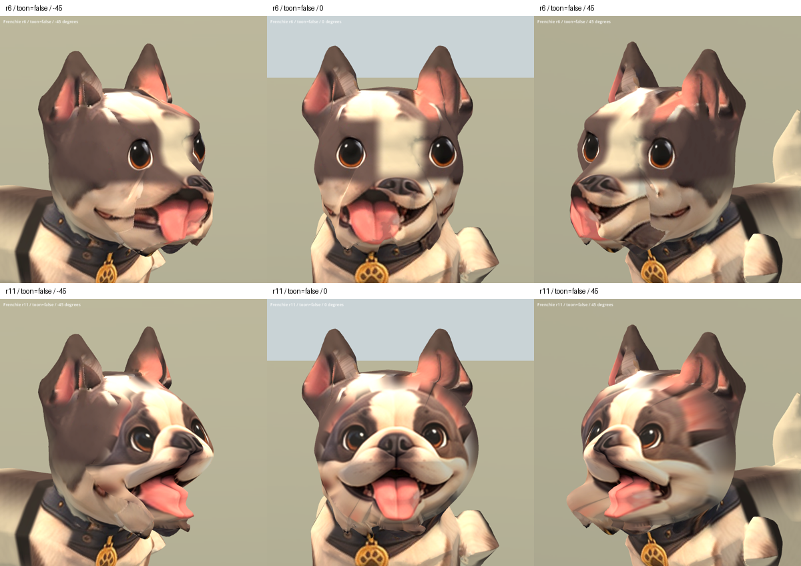

# 法鬥整臉修復 r11 — 2026-10-04

承接使用者認可的博美 r10 整臉重建方式，完成法鬥第一版。這是獨立候選，
`enc_gym` 的阿鬥仍使用原 runtime 模型；本次已上線的資產是博美。

## 修改

以原始法鬥正面設定圖重建連續臉面，重新配置短寬口鼻、雙側嘴墊、鼻頭、
嘴部凹陷與舌面。鼻頭靠近眼睛，沒有照搬博美的長口鼻比例。
移除 7,478 個舊臉三角形，以 288 點邊界連接新面；全模型 51,950 三角形。

- 候選：`assets/art_previews/dogs/candidates/r11/frenchie.glb`
- 未修改基線：同目錄 `frenchie_r6.glb`
- 重建：`tools/art/rebuild_breed_face.py`、`rebuild_frenchie_face_r11.py`
- 驗證：`tools/art/validate_frenchie_r11.py`、`verify_frenchie_r11.ps1`
- 原始設定圖：`../good_human_stylized_factory/references/dogs/frenchie_front.png`
- SHA256：`03acf253bd4a9ad5f6fac1b00389860177d31eb43e57e111e31dad0265964c99`

## 驗證與限制

骨架節點、bind matrices、Idle/Sit/Walk channels、keyframes 和 interpolation
與原始模型一致。頂點/法線有限、權重和為 1、joint index 有效，沒有退化三角形。
Blender 已檢視正面、左右 45 度及側面。Godot 檢查五角度、兩種材質與各動畫
25/50/75% 時間點；截圖與日誌存於 `build/frenchie_face_r11/`。

整臉連續性改善，但下巴接頸部、耳根、側臉貼圖仍有舊模型痕跡。模型仍超過
8–20k 目標，屬 B 級修復候選，不能宣稱 S 級完成。此次沒有新第三方素材，
沿用原 breed factory 來源與骨架授權限制。

[整臉修復流程](DOG_WHOLE_FACE_REPAIR_WORKFLOW.md)
