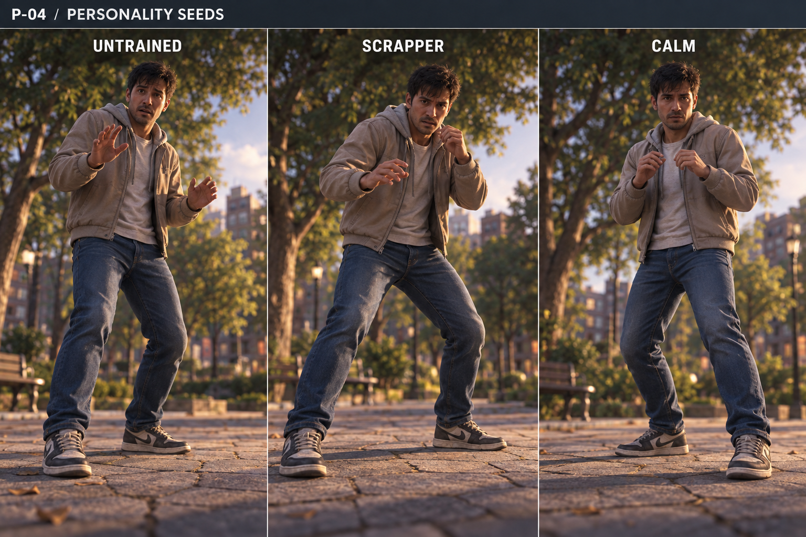

# D4-23 — Combat Personality Seeds v0.1

Status: REVIEW · 2026-09-28 · Codex ART

[Generation prompt and provenance](../../assets/_source/design/p04/D4_23_GENERATION_RECORD.md). Built-in image_gen, grade R. Visual exploration only, not new fighter classes or stat profiles. Extends [D4-18](P04_MOTION_LANGUAGE_01.md); all existing contact and timing rules remain authoritative.

## Same person, different manner

Keep identity, body proportions, clothes, camera, action duration and outcome identical when comparing these seeds. The names are internal art labels; they do not imply progression, skill rank, damage, accuracy or combat difficulty. Do not assign a wardrobe or body type to a seed.

| Beat | UNTRAINED | SCRAPPER | CALM |
|---|---|---|---|
| Idle | Uneven hand heights; raised shoulders; small uncertain weight transfer | Forward attention; asymmetric open guard; planted wide base | Relaxed shoulders; compact guard; balanced stagger |
| Approach | Short checking step before settling | Torso commits with a direct grounded step | Economical step, gaze stays on other person |
| Circle | Hips follow a little after shoulders | Strong outside-foot push; guard remains asymmetric | Small clean lateral placement, restrained upper body |
| Windup | More visible preparatory hand/shoulder adjustment | Clear hip/shoulder commitment | Small preparatory motion, still fully readable |
| Miss recovery | Extra visible hand reorganization inside existing recovery window | Shoulder carries through then a strong catch | Short controlled unwind, no instant reset |
| Hit reaction | Surprise shows in eyebrows and hands after compression | Guard breaks outward then regathers | Brief loss of composure; honest compression still visible |
| Down | Uneven human fall | Uneven human fall | Uneven human fall |

Down and physical impact never become weaker because a person looks composed. All seeds must show the same confirmed magnitude and contact position. Calm is not invulnerability; Untrained is not a guaranteed miss; Scrapper is not an aggression/AI setting.

## Animation controls

Explore guard openness, shoulder tension, head settling and recovery gesture amplitude. Keep attack reach, travel, contact timestamp, action length and collider unchanged. Fit secondary gestures into existing phases rather than adding hesitation time. If a readable variation cannot fit, flag it for review; do not change simulation to fit the art.

Personality yields to action readability, injury and spatial constraints. HEALTHY/HURT/CRITICAL remain condition layers, not personalities. A Calm person at CRITICAL must still look unstable. Dog-related affection or alarm can interrupt a neutral facial manner without changing the owner's identity.

## Comparison review

Record the same short idle → approach → jab/block → missed heavy → recovery sequence for all three seeds. Repeat on at least two different ordinary outfits and body builds. Randomize comparison order and hide labels: ask viewers to describe manner, then check whether any outfit is being mistaken for power. Do not demand that viewers infer internal names.

At 405×720, compare front-oblique and dog-eye views. Reject silhouette changes that hide hands against torso, make Calm anticipation unreadable, create foot slide or make Untrained comic slapstick. Preserve identical outcomes across comparison clips.

## Still review and handoff

Board supports guard, shoulder and stance comparison only. Still poses cannot validate timing, identity across animation, outfit independence or equal gameplay outcome. These checks remain pending runtime captures. No animation clips, rig, stats, AI or code changed. Selected direction remains open for review; do not install a default seed simply because it is pictured.
