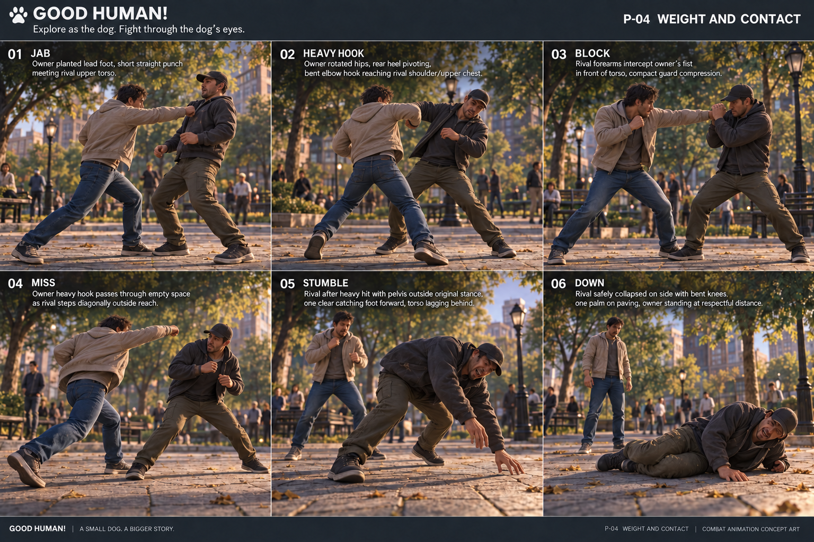

# D4-20 — Contact / Impact Frames v0.1

Status: REVIEW · 2026-09-28 · Codex ART

Selected reference: `p04_contact_frames_02.png`; original v01 retained. Built-in image_gen; [exact prompts and provenance](../../assets/_source/design/p04/GENERATION_RECORD.md).

## Still-image inspection

The revised Heavy Hook has a bent elbow and rear-foot pivot, unlike the straight Jab in panel 01. Block, empty-space Miss, low Stumble and Down are visually separated. Remaining limitations: the hook fist/contact patch is partially occluded; panel 04 illustrates empty-space follow-through rather than an exact matching bent-elbow hook pose; panel 05 is a deep near-fall and should be the extreme of Stumble, not every ordinary catch step. The frame prescription below takes precedence over those image details. A side-oblique animation review must resolve contact alignment before approval. The board remains grade R, not final character art or an animation source.

Companion: [motion language](P04_MOTION_LANGUAGE_01.md). The board is an illustration of pose intent, never proof of a working animation.

## Key-frame prescription

Read each row as pre-contact → contact or closest pass → release. Frame offsets below use 30 fps solely for authoring review, not a new runtime timing requirement.

| Outcome | −3 frames | 0 | +3 to +8 frames |
|---|---|---|---|
| Jab contact | Lead shoulder advances; receiving torso not yet recoiling | Fist reaches upper torso; contact-side cloth and ribs compress | Short local recoil then settle; attacker hand retracts |
| Heavy contact | Hips wind then lead shoulder; defender retains its old base | Bent-elbow hook meets shoulder/upper torso; compression precedes displacement | Pelvis leaves base, catching step follows; attacker unwinds |
| Block | Forearms enter line before fist arrives | Fist meets forearm, visibly separated from chest | Guard/shoulders yield together; planted base absorbs force |
| Missed heavy | Attacker commits while receiver steps off line | Visible air gap between striking hand and receiver; no false contact | Attacker shoulder follows through, recovery foot catches; receiver stays unhit |
| Stumble | Prior impact has already broken balance | Head/torso lag behind pelvis; receiving foot reaches toward displaced weight | Foot catches, knees yield, guard returns unevenly; no automatic Down |

Down appears only as a comparison pose: low, bent, non-rigid and clearly different from the still-standing stumble. It is not a mandatory outcome of the illustrated exchange.

## Contact priority

1. Anatomical hand/forearm/body alignment and support-foot contact.
2. Receiver compression and physically understandable weight shift.
3. Cloth response, then a restrained contact-local accent if used.
4. Existing hitstop/camera response only after real contact.

Block must read without teal; direct hit must read without coral. Miss has neither contact pulse nor hitstop. Preserve the existing P03 impact vocabulary; this pass proposes no FX-code changes or new timing caps.

## Review checklist

- Fist does not pass through a forearm into the torso on a blocked attack.
- Heavy reaction includes a catch step rather than a scaled light-hit lean.
- Miss has visible separation in the frame of nearest approach.
- Stumble remains standing and recoverable; Down is unmistakably low.
- Feet and contact limb survive dog-height cropping; no bright flash hides mistakes.

Runtime clips and a portrait-size review remain pending; no gameplay QA was performed in this ART session.
