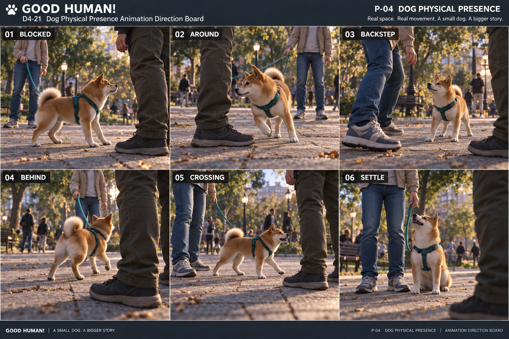

# D4-21 — Dog Physical Presence v0.1

Status: REVIEW · 2026-09-28 · Codex ART

Built-in image_gen reference board, grade R; [exact prompt and provenance](../../assets/_source/design/p04/D4_21_GENERATION_RECORD.md). Panels 01–05 correspond to A–E below; 06 is an optional calm relationship comparison, not a forced sit during combat.

### Visual review of the reference

Paws and relevant human shoes are visible; stopped, stepping, crossing and settled silhouettes differ. The dog remains naturally smaller than the humans, with a consistent teal harness. This board is useful for pose and spacing review but not production leash topology: panel 02 hides part of the leash behind the rival leg, panel 03 does not show a traceable complete leash, and panel 06 appears to attach at the collar/front instead of the dorsal harness ring. Use the anchor rules below, not these image details. Backward motion and temporal crossing clearance require animation, so neither is considered validated by the stills. No S/A asset approval is implied.

Scope: the five situations in [P-04 workstream](P04_COMBAT_MOTION_DESIGN_WORKSTREAM.md). Extends [P03 dog POV](dog_agency/P03_DOG_POV_COMPOSITION.md) and [D4-18 motion language](P04_MOTION_LANGUAGE_01.md). This is an animation/presentation handoff, not implemented collision behavior or gameplay QA.

## Physical thesis

The dog occupies the same ground as the humans. Near legs feel large through natural scale, grounded feet and a low viewpoint. A blocked dog must stop gaining ground; a moving dog must place paws; a retreating human must visibly approach before space becomes crowded. Do not use body overlap, foot skating or a rubber-like squashed dog to communicate collision.

Use current 3D art direction and approximately 35–45 cm dog eye height. The earlier `DOG_HUMAN_SCALE_GUIDE.md` describes top-down sprites; its pixel ratios, enlarged heads and ellipse footprints are not a 3D scale/collision specification. Match the actual dog model and human anatomy. Any final model scale change requires a separate review.

## Five situation boards

Each beat is ordered **approach → spatial constraint → readable response → release**. The pose follows resolved movement; the animation cannot choose the dog's escape direction.

| Case | Approach and spatial cue | Constraint pose | Response and release | Reject |
|---|---|---|---|---|
| A · Blocked by leg | Dog advances toward a planted human leg; toe, shin and visible paving establish the obstacle | Advance stops at collision resolution; forepaws support weight, chest settles, muzzle remains clear | If input ceases, settle to attentive idle. If movement continues along an allowed tangent, transition to B | Nose inside trousers; continuous run cycle at zero travel; bouncing off the leg |
| B · Around human | Player movement has a free component along the outside of a human footprint | Head turns toward permitted travel; shoulders and hips follow progressively | Inside/outside paws take short unequal steps around the outside shoe; turn returns to ordinary gait as clearance increases | Rigid sideways glide, moonwalk, pelvis teleport or automatic orbit without player movement |
| C · Retreating human approaches dog | Rear shoe, hem and shadow visibly move closer while human remains opponent-facing | Dog remains grounded; ears/head can register proximity, but position follows actual simulation | If player retreats or sidesteps, paws follow that travel; if stationary, use attentive bracing only. If collision displaces dog, animate the resolved displacement | Foot landing on back/paw, invented autonomous escape, shove knockback or damage implied only by animation |
| D · Circles behind opponent | Dog's resolved path follows an outer rear-quarter arc | Near rival leg occupies a side of view; owner remains the identifiable person beyond | Dog reorients over several steps; harness and owner's hand preserve relationship. End in current movement/idle | Running between a planted pair of legs, forced camera orbit, rival attached to teal leash |
| E · Crosses fighter path | Dog enters a currently open lane in front of or between projected human routes | Paths may overlap over time, but occupied bodies must not overlap at the same instant | Animate passage only when movement resolves through open space. If lane closes, return to A/B as movement resolves | Guaranteed safe crossing, forced human freeze, automatic trip, attack cancel or combat opening not emitted by simulation |

## Motion layers and priority

1. Actual position, velocity, grounded result and existing combat outcome remain authoritative.
2. Support paws and body balance follow resolved travel, including collision correction.
3. Spine, head, ears and tail express proximity without moving the collision body.
4. Harness and leash settle after the body; small secondary motion must not obscure the available route.

Use available rig channels only; expressions needing missing ear/spine controls are future asset requirements, not assumed runtime capability. There is no new mandated clip name or engineering API in this pass.

### Entering a stop

Decelerate the gait when resolved speed falls; shorten the next step and lower the chest slightly into support. Head may turn toward a visible free side without auto-steering. Hold a quiet braced pose if position remains blocked. Do not keep cycling all paws because requested speed is high.

### Moving around a shoe

This is a curved walking path. The inside paws take shorter steps than outside paws; shoulders lead a modest turn and pelvis follows. Keep planted paws fixed until lift-off. If collision correction is too large for believable plants, shorten/release the plant and flag the motion mismatch rather than stretch the leg.

### Yielding to an approaching person

An attentive head/ear change is permitted while stationary; an avoidance step is permitted only when it matches resolved movement. A human's visual foot trajectory must agree with its body motion and ground contact. Never draw a planted foot skating through the dog to preserve an unrelated combat pose. Conflicting paths are an engineering capture issue; this document does not choose a new avoidance rule.

## Leash continuity

- Trace teal leash from the player's dorsal harness anchor to the owner's hand, never to the rival. Use actual anchor movement; no detached floating endpoint.
- A slack leash can leave a first-person frame. When visible, its curve should follow the available side, not cut across a face, contact limb or dog neck.
- Behind-opponent circulation is a stress case. Do not assert that every full orbit has a physically clear leash route. Capture any wrap/intersection against calves, dog or ground as an unresolved integration issue.
- Concept boards may stage an open outer route. That staging is not permission to teleport the leash through the rival, move the dog automatically, break the attachment or grant unlimited stretch.
- Tension is a visible relationship state only when the current game reports it. No automatic trip, Pull activation, opponent opening or damage is introduced here.

## Camera contract

Reference art uses an external low observer to expose paw/leg clearances that cannot all be seen in first person. In runtime, inherit dog-eye CombatCenter behavior; do not pull into a new third-person combat camera to show these poses. Shoe approach, lower-leg movement, ground flow and occasional harness/leash edges provide first-person physical cues. The art board is not proof that the first-person view passes.

Use existing camera limits and collision behavior. Do not clip the lens into clothing, climb up the human body or spin behind the dog to make an ideal composition. A blocked navigation direction should remain distinguishable from a camera obstruction. D4-22 will examine the moving-body composition separately.

## Implementation capture requests — acceptance pending

Record at 405×720 with debug geometry and combat labels hidden. Slow review of a separate diagnostic capture may inspect feet/anchors, but the acceptance view is normal presentation. These are ART review requests, not completed blind QA.

| Capture | Required observation | Failure evidence |
|---|---|---|
| A1 Hold movement into a planted leg, then release | Ground travel stops; gait settles; clear dog/leg separation | Repeated walking-in-place, penetration, unstable bobbing |
| B1 From A1 move tangentially left and right | Curved steps track actual travel and both directions recover cleanly | Foot skate, abrupt 180° torso snap, unsolicited orbit |
| C1 Human backs toward stationary dog, then moving dog | Proximity reads before crowding; body and foot contacts remain credible | Foot through dog, dog displacement without corresponding gait |
| D1 Move front → flank → rear quarter → flank | Owner remains recognizable; teal ownership and escape lane remain readable | Leash through legs, rival mistaken as owner, full owner occlusion |
| E1 Cross while lane is open; repeat while lane closes | Open crossing is grounded; closed crossing responds to resolved constraint | Overlap, forced jump, invented stagger or opening |
| L1 Repeat near a curb/wall and with leash tension | No stretch/ground intersections or route invented solely for the board | Buried paws, camera inside leg, disconnected or impossible leash route |

Review both owner and rival legs as obstacles; both travel directions; moving and planted feet; actual idle/walk/run transitions. Injury state may change a human's stance but must not change visual dog size or invent dog reactions. Record failures with case ID, phase and frame; do not accept a still image as evidence that these captures pass.

## Deliverable boundary

This pass delivers scenario staging and pose/continuity requirements. No meshes, collisions, camera settings, combat rules or animation files are changed. D4-22 and D4-23 remain separate work items.
