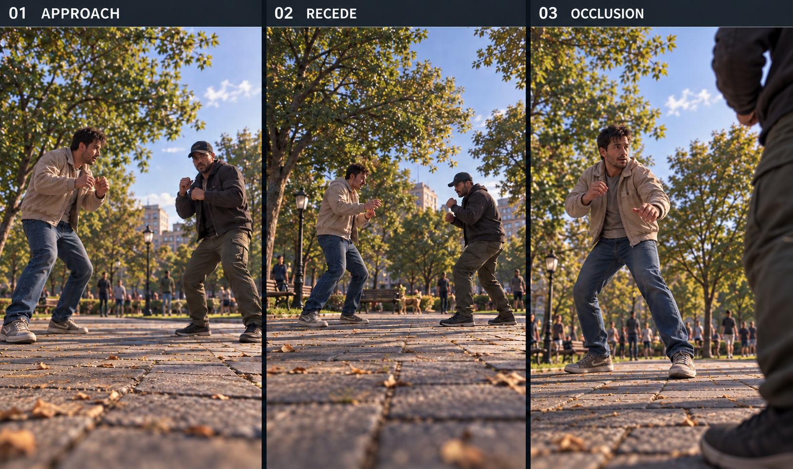

# D4-22 — Dog POV Brawl Composition v0.1

Status: REVIEW · 2026-09-28 · Codex ART

Built-in image_gen, grade R reference. [Prompts and provenance](../../assets/_source/design/p04/D4_22_GENERATION_RECORD.md). This extends [P03 composition](dog_agency/P03_DOG_POV_COMPOSITION.md), [D4-19 footwork](P04_FOOTWORK_BOARD_01.md) and [D4-21 physical presence](P04_DOG_PHYSICAL_PRESENCE_01.md). It does not reopen the combat-camera direction or claim runtime verification.

## What the board establishes

Three portrait views compare approach, recession and a close rival at the edge. Beige jacket/blue jeans identify the owner; charcoal jacket/olive trousers identify the rival only within this reference. Clothing is not a combat-strength cue.

| Panel | Intended read | Still-image observation | Remaining limitation |
|---|---|---|---|
| 01 APPROACH | Two people feel nearer without consuming the whole portrait | Owner and rival have distinct guards, visible shoes and open foreground | Owner's left shoe touches the edge; an uninterrupted side route is not fully demonstrated. Treat as a framing margin warning, not an approved crop |
| 02 RECEDE | Pair becomes smaller as world distance grows | More foreground separates viewer from pair; both stances remain visible | Small hands cannot prove attack identification at mobile size; blurred near paving is mood, not a prescribed depth-of-field setting |
| 03 OCCLUSION | Near rival passes at edge while owner remains recognizable | Revised rival is a narrow right-side foreground mass; owner face, chest, arms and shoes remain visible | Rival attack limb is mostly outside view. Suitable as a passing/recovery moment, not proof of readable enemy windup or contact |

The original `p04_dog_pov_composition_01.png` is retained as a rejected normal-composition variant: panel 01 is overly close and panel 03 spends too much width on the rival. Both versions remain reference art, not production character assets. The revised board improves spatial hierarchy but does not demonstrate every acceptance condition below.

## Continuous camera contract

- Inherit dog-eye first-person combat and the existing CombatCenter framing; approximately 35–45 cm eye height. Dog movement remains player-controlled.
- Approach and recession change apparent body size naturally. Do not resize meshes or force an equal-height zoom whenever a fighter steps.
- Use the established bounded orientation/dead-zone behavior. This document adds no FOV values, tracking gains, camera sockets or forced orbit.
- A modest existing framing adjustment is permissible within current camera limits. It cannot mean moving the dog, elevating to human height, jumping through collision or inventing a cut.
- Do not use transparent bodies, hidden limbs or giant hit flashes to repair an unreadable strike.

## Screen-space budget

Evaluate the gameplay picture at 405×720, excluding the reference board's title bars. Use these as review guides inherited from P03, not new hard-coded clamps.

| Element | Normal target | Priority / exception |
|---|---|---|
| Owner identity | Face/head and torso readable together | Highest relationship priority; simultaneous loss is a failure requiring review |
| Active action | Striking limb plus receiver guard/body visible during windup and contact | A portrait with readable faces but hidden action does not pass |
| Escape direction | Roughly 15–25% width of continuous visible ground where practical: about 61–101 px at 405 px | A patch of pavement between shoes is not proof of a navigable lane; compare with actual collision |
| Near rival obstruction | Around one third width or less, about 135 px at 405 px | A passing pose can exceed normal size briefly, but never becomes a target composition for an active strike |
| Full-body normal exchange | Around 70% picture height or less: about 504 px at 720 px | Extreme close passage can crop a person; retain the action and owner instead of forcing full-body visibility |
| Support feet | Visible for kick, dodge, stagger, recovery and Down | Promote above secondary background and rival-dog detail when balance is the cue |

These targets can conflict in a genuinely crowded scene. Record the conflict; do not declare success by counting pixels while contact is hidden. During an upper-body exchange, a temporary foot crop is preferable to losing the owner's face or active hand. During a balance-dependent action, missing support-foot evidence remains a failure even if the upper body reads well.

## Movement cases and failure recovery

| Case | Preserve as bodies move | Permitted presentation response | Review failure |
|---|---|---|---|
| Pair approaches stationary dog | Owner identity, contact axis, open ground | Existing bounded tracking follows CombatCenter; let near person grow naturally | Near torso fills image, lens enters clothes, dog is moved to rescue composition |
| Pair recedes | Direction of attack and recognizable owner | Allow natural scale reduction; retain restrained material/pose contrast | Zoom pumping, sudden FOV change, hands too small to classify action |
| Rival crosses foreground | Owner through an open side; awareness of rival | Allow brief screen drift before existing smooth correction | Owner head and torso lost together, whip-pan, rival windup hidden |
| Owner enters near edge | Rival anticipation across remaining frame | Keep owner as near relationship cue without centering the jacket | Owner blocks entire rival or player's movement lane |
| Dog crosses fight axis | Continuous world orientation and readable ownership | Respect current tracking limits, retain stable environmental landmarks | Instant left/right flip or forced orbit that rewrites dog control |
| Human staggers toward lens | Displaced hips and catching foot; usable retreat cue | Follow existing camera behavior; secondary effects stay small | Camera impulse hides approach, feet vanish at critical catch frame |
| Fight reaches wall/curb | Ground plane, human contact, camera clearance | Existing collision response only | Camera rises over wall, clips body, or an apparent escape lane is blocked |

If owner visibility, active contact and collision-safe first-person framing cannot coexist, record the precise world setup for engineering/design review. This ART pass does not prescribe an unauthorized camera mode or claim that widening alone can solve physical occlusion.

## 8-second composition review

Reuse the authored D4-19 sequence to compare the same movement across views. Its coordinates/timing remain staging proposals, not simulation configuration.

| Sequence beat | Composition question |
|---|---|
| 0–2 s: approach and circle | Does natural scale growth preserve separated hands and grounded stances? |
| 2–3.6 s: jab, block, backstep | Is the guard contact distinguishable from torso impact as the pair separates? |
| 3.6–4.8 s: heavy miss | Is the gap at closest pass visible, rather than hidden behind a near jacket? |
| 4.8–6.2 s: counter and stagger | Can viewer see the receiving body and the foot that catches weight? |
| 6.2–8 s: reset | Does framing settle without repeatedly correcting around the dead-zone boundary? |

Repeat from front, left flank, right flank, rival rear quarter and owner-side flank. Also record a stationary dog while both people move toward/away from it; dog motion alone cannot validate the requirement. Repeat with a moving dog, then near a wall/curb. Observe existing leash tension when available; the board deliberately omits slack leash and therefore does not validate leash visibility or attachment.

## Acceptance record template — all pending runtime capture

No blind QA or playable-build verification occurred in this ART session. Capture under normal presentation at 405×720, then review frame-by-frame for cause; a debug view can supplement an ART diagnosis but cannot substitute for the normal frame.

| Check | PASS evidence required | Current evidence |
|---|---|---|
| Owner identity | Recognizable owner throughout each transition, no simultaneous head/torso loss | Still reference only; runtime pending |
| Action read | Jab/Hook/Kick and Block/Miss/Hit distinguished without text/HP/FX assistance | Runtime pending |
| Balance | Support feet readable through kick, dodge, stagger and Down | Runtime pending |
| Distance change | Approach/recede retain readable poses without scale cheats or zoom pumping | Still scale comparison only; runtime pending |
| Navigation | Viewer can infer a route that agrees with actual collision | Runtime pending |
| Comfort | No sudden yaw reversal, sustained oscillation or vertical jump | Runtime pending |
| Leash ownership | Any visible teal segment traces to owner; no face/contact obstruction | Not depicted; runtime pending |

For every failure, record viewpoint, motion direction, action phase, first/last affected frame, and whether the missing cue is owner, action, support foot or route. Do not average a hidden contact frame away because the rest of a clip looks good.

## Handoff

Delivered: portrait reference triptych, near-body stress comparison, explicit framing priorities and dynamic capture checklist. No game code, scene, camera data, animation or collision changes. D4-23 combat personality exploration remains next.
