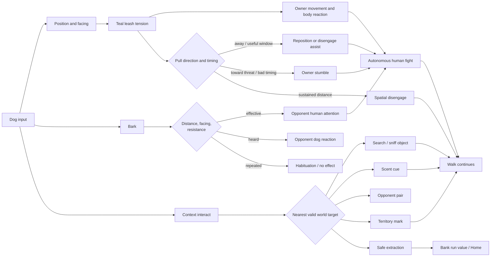

# Sprint 04 — Dog Agency Interaction Map v0.1

Status: REVIEW
Deliverable: D-01
Camera: accepted dog-height chase view

## Relationship ownership

| Relationship | Primary world cue | HUD support | Never communicate with |
|---|---|---|---|
| Dog ↔ owner | Teal leash shape and owner pose | Short consequence toast only | Numeric tension meter |
| Dog ↔ opponent human | Bark direction and human reaction | Outcome toast | Buff icon or stun bar |
| Dog ↔ opponent dog | Head direction, stance and bark-back | Optional short dog vocal | Nameplate-only reaction |
| Dog ↔ searchable object | Object silhouette and rarity scent | Context Interact label | Permanent quest arrow |
| Dog ↔ desire target | Violet/mint scent and thought card | Nose arrow only while off-screen | Checklist or reward preview |
| Dog ↔ territory | Root scent knots and Mark prompt | Risk/temptation copy when relevant | Flag, capture ring or ownership meter |

## Input priority

1. Movement is always available, including during seamless combat.
2. Bark is its own contextual action and never replaces movement.
3. Interact resolves only the closest valid target within the existing interaction area.
4. Pull is not a button; it emerges from movement, leash tension and owner state.
5. Disengage emerges from spatial distance and never uses a leave-combat modal.

## Composition priority

At the accepted dog-height camera, preserve this read order: player dog → teal leash → owner → current world target → opponent pair → supporting HUD. A nearby searchable object remains interactable during combat and must not be hidden by encounter framing.
